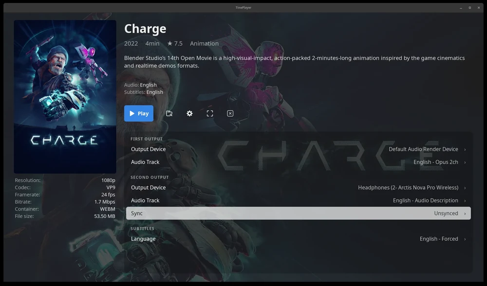
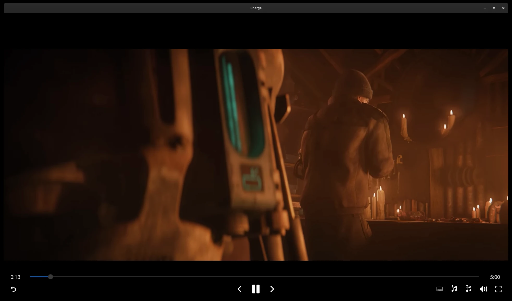

<h1 align="center">
  <br>
  TinePlayer
</h1>

<p align="center">
  Watch together, hear your own soundtrack.
</p>

<p align="center">
  <a href="https://tineplayer.app">tineplayer.app</a> &middot;
  <a href="https://tineplayer.app/download/">Download</a> &middot;
  <a href="https://tineplayer.app/docs/">Documentation</a> &middot;
  <a href="https://tineplayer.app/screenshots/">Screenshots</a>
</p>

<p align="center">
  <a href="https://github.com/scottarius/TinePlayer/releases/latest"></a>
  <a href="https://github.com/scottarius/TinePlayer/actions/workflows/ci.yml"></a>
  
  
  <a href="./LICENSE"></a>
</p>

Play any video and send two soundtracks to two different audio devices at the
same time. A second language on headphones, the original on speakers, audio
description for whoever needs it. Many people experience films differently;
TinePlayer lets you experience them together.

<p align="center">
  
</p>

**This README is for people working on TinePlayer.** If you are here to use it,
everything is on [tineplayer.app](https://tineplayer.app): what it does,
[downloads](https://tineplayer.app/download/) for Windows, macOS and Linux, and
the [documentation](https://tineplayer.app/docs/).

## How it works

TinePlayer is written in Rust, draws its interface with
[GTK 4](https://www.gtk.org/), and plays everything through
[GStreamer](https://gstreamer.freedesktop.org/). A video file's audio tracks
are already separate streams inside the container, so the file is demuxed once
and each chosen track is sent to its own output device from a single pipeline.
Staying in step is not something that has to be maintained - it is all one
clock.

The same split serves an audio description track, or a separate audio file
sitting beside the video, which can be aligned to the picture automatically.

<p align="center">
  
</p>

<p align="center">
  <sub><i>Charge</i> &copy; <a href="https://studio.blender.org/videos/charge/">Blender Studio</a>,
  <a href="https://creativecommons.org/licenses/by/4.0/">CC BY 4.0</a></sub>
</p>

## Build from source

```sh
.\setup-windows.ps1         # Windows; ./setup-mac.sh on macOS, ./setup-linux.sh on Linux
cargo build --release
./target/release/tineplayer
```

Each setup script installs only what is needed to build, and is safe to re-run.
`main` is the development branch and a build from it reports a version ending
in `-dev`; to build a release, check out its tag:

```sh
git clone --branch v1.0.0 https://github.com/scottarius/TinePlayer
```

See **[docs/building.md](docs/building.md)** for what each script installs, what
to do on distributions without `apt`, and the traps around taking GTK and
GStreamer from different places.

Packaging - the Windows installer, the macOS disk images and the Debian
packages - is under [`packaging/`](packaging).

> [!NOTE]
> **On macOS, build the packaged application rather than a local one** if a
> screen reader matters to you. A build against Homebrew's GTK is silent to
> VoiceOver, because that build has no AccessKit backend compiled in. See
> [Accessibility](https://tineplayer.app/docs/getting-started/accessibility/).

## The source

The Rust source is located in `src/`. The parts worth knowing about:

| | |
| --- | --- |
| `app/` | The interface, a module per screen or panel - the media page, settings, the choosers, the file browser, input handling |
| `pipeline.rs`, `player.rs` | The GStreamer pipeline, and playback state |
| `audio.rs`, `subtitles.rs` | What each output and the subtitle layer can play, and what gets chosen automatically. One list and one selector each, so a preference and a command-line flag cannot disagree about what `en` means |
| `beside.rs` | Audio and subtitle files sitting next to the video, found by one convention read from both sides |
| `jellyfin.rs`, `kodi.rs` | Casting from Jellyfin, and handing playback back and forth with Kodi |
| `i18n.rs` | How the `po/` catalogs are compiled into the binary |
| `config.rs`, `logging.rs` | `config.yaml`, `positions.json` and `tineplayer.log` |

Everything goes through `cargo clippy --all-targets -- -D warnings` and
`cargo test` before it lands. CI runs both on all three platforms, along with
`cargo fmt`, `cargo deny`, and checks that the translation template and the
bundled fonts still cover every interface string.

## Translating

TinePlayer's interface is translated in `.po` files under `po/`. You do not
need to build anything and you do not need to know Rust - see
**[docs/translating.md](docs/translating.md)** for adding a language, and for
pointing a release build at your file with `TINEPLAYER_PO` so you can see your
work without compiling.

## Compatibility

TinePlayer targets a deliberately conservative baseline of **GTK 4.6** and
**GStreamer 1.18**, so it builds on the distributions people actually run
rather than only current ones. GTK 4.x and GStreamer 1.x are both API- and
ABI-stable within their major version, so building against that baseline still
runs correctly on much newer releases.

| System | GTK 4 | Status |
| --- | --- | --- |
| Windows 10 / 11 | 4.20 (bundled with GStreamer) | Tested |
| macOS 26 (Apple Silicon) | 4.22 (Homebrew) | Tested |
| Raspberry Pi OS / Debian 12 (Bookworm) | 4.8 | Tested |
| Ubuntu 22.04 LTS | 4.6 | Installs and runs |
| Ubuntu 24.04 LTS | 4.14 | Installs and runs |
| Debian 13 (Trixie) | 4.18 | Installs and runs |

Both Wayland and X11 sessions are supported; the backend is chosen at runtime.
**Tested** means a full run on real hardware: playback, two audio outputs and
the whole interface. **Installs and runs** means the released package was
installed on that release and the interface verified there, but playback and
dual output have not been exercised. Reports welcome.

One consequence of that baseline: the GTK 4.14+ `dmabuf` zero-copy rendering
path is not used, so newer systems do not gain that particular optimization.
The OpenGL path used instead handles 1080p comfortably, including on a Pi 5.

## Reporting problems

[Open an issue](https://github.com/scottarius/TinePlayer/issues) for anything
broken, or [start a
discussion](https://github.com/scottarius/TinePlayer/discussions) for anything
else. Reports from people who use a screen reader or rely on audio description
are especially useful.

The log is the most useful thing to attach - see [Log
file](https://tineplayer.app/docs/settings/where-data-is-saved/#log) for where
it is and what is in it. **Security problems go
[privately](https://github.com/scottarius/TinePlayer/security/advisories/new)**
rather than into an issue; [SECURITY.md](SECURITY.md) says what is already
known and deliberate.

## How this was built

Written collaboratively with an AI assistant (Claude). While Claude wrote the
bulk of the code, every architectural and design decision, and all testing and
verification, was done by hand.

## License

TinePlayer's own code is MIT. See [LICENSE](./LICENSE). The logo and the
artwork under `data/branding/` are CC BY 4.0, with their own license file
beside them.

It builds on the following, none of which are vendored into this repository:

- **GStreamer** ([LGPL
  2.1](https://gstreamer.freedesktop.org/documentation/frequently-asked-questions/licensing.html))
  and **GTK 4** (LGPL 2.1) are runtime dependencies, loaded as separate shared
  libraries and never vendored. Where they come from depends on the platform:
  the Windows and macOS packages ship them beside the executable, unmodified,
  with their license texts; the Linux package ships none of them and declares
  them as dependencies for apt to install from your distribution; a build from
  source uses whatever is already on the machine. Being separate shared
  libraries in every case, they can be replaced with your own build of the
  same version, which is what the LGPL asks for.
- **`gst-plugin-gtk4`** (MPL-2.0) provides the `gtk4paintablesink` element and
  *is* statically linked into the binary, because it is not packaged by Debian
  or shipped with the GStreamer Windows installer. Depending on it as an
  ordinary crate avoids making every user build and install a plugin by hand.
  MPL-2.0 is file-scoped copyleft, so it combines with MIT code without
  affecting this project's own licensing; the plugin's source remains under
  MPL-2.0 and is available
  [upstream](https://gitlab.freedesktop.org/gstreamer/gst-plugins-rs).

Every Rust library compiled into TinePlayer, direct and transitive, is listed
with its license in **[THIRD-PARTY.md](./THIRD-PARTY.md)**. Nearly all are MIT
or Apache-2.0, and their notices travel with the application as those licenses
ask: the same list is readable in the application itself, under **Settings →
About TinePlayer → Third-Party Notices**.
